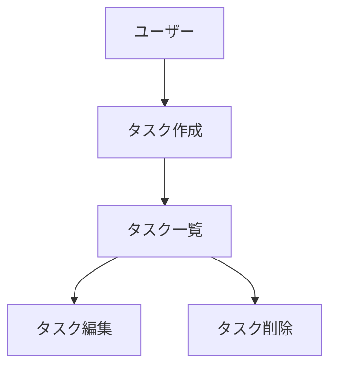

# CLAUDE.md (プロジェクトメモリ)

## 概要
開発を進めるうえで遵守すべき標準ルールを定義します。

## プロジェクト構造

### ドキュメントの分類

#### 1. 永続的ドキュメント（`docs/`）

アプリケーション全体の「**何を作るか**」「**どう作るか**」を定義する恒久的なドキュメント。
アプリケーションの基本設計や方針が変わらない限り更新されません。

- **product-requirements.md** - プロダクト要求定義書
  - プロダクトビジョンと目的
  - ターゲットユーザーと課題・ニーズ
  - 主要な機能一覧
  - 成功の定義
  - ビジネス要件
  - ユーザーストーリー
  - 受け入れ条件
  - 機能要件
  - 非機能要件

- **functional-design.md** - 機能設計書
  - 機能ごとのアーキテクチャ
  - システム構成図
  - データモデル定義（ER図含む）
  - コンポーネント設計
  - ユースケース図、画面遷移図、ワイヤフレーム
  - API設計（将来的にバックエンドと連携する場合）

- **architecture.md** - 技術仕様書
  - テクノロジースタック: Next.js (App Router) / TypeScript / Tailwind CSS / npm
  - 開発ツールと手法
  - 技術的制約と要件
  - パフォーマンス要件

- **repository-structure.md** - リポジトリ構造定義書
  - フォルダ・ファイル構成
  - ディレクトリの役割
  - ファイル配置ルール

- **development-guidelines.md** - 開発ガイドライン
  - コーディング規約
  - 命名規則
  - スタイリング規約
  - テスト規約
  - Git規約

- **glossary.md** - ユビキタス言語定義
  - ドメイン用語の定義
  - ビジネス用語の定義
  - UI/UX用語の定義
  - 英語・日本語対応表
  - コード上の命名規則


#### 2. 作業単位のドキュメント（`.steering/[YYYYMMDD]-[開発タイトル]/`）

特定の開発作業における「**今回何をするか**」を定義する一時的なステアリングファイル。
作業完了後は参照用として保持されますが、新しい作業では新しいディレクトリを作成します。

- **requirements.md** - 今回の作業の要求内容
  - 変更・追加する機能の説明
  - ユーザーストーリー
  - 受け入れ条件
  - 制約事項

- **design.md** - 変更内容の設計
  - 実装アプローチ
  - 変更するコンポーネント
  - データ構造の変更
  - 影響範囲の分析

- **tasklist.md** - タスクリスト
  - 具体的な実装タスク
  - タスクの進捗状況
  - 完了条件

### ステアリングディレクトリの命名規則

```
.steering/[YYYYMMDD]-[開発タイトル]/
```

**例：**
- `.steering/20250103-initial-implementation/`
- `.steering/20250115-add-tag-feature/`
- `.steering/20250120-fix-filter-bug/`
- `.steering/20250201-improve-performance/`

## 開発プロセス

### インクリメンタル開発の原則

- 永続的ドキュメント（`docs/`）はアプリ全体の理想像を定義するが、**実装は一度にすべてを作らない**
- 1つのステアリングで扱う範囲は **「1機能」または「密接に関連する少数の機能」** に絞る
- 各ステアリングの実装が完了・動作確認できてから、次のステアリングに進む
- 先のステアリングで作った機能の上に、次の機能を積み上げていく

#### 1ステアリングのサイズ目安

- **新規作成ファイルは最大5〜8ファイル程度**に収める
- 「この機能だけで画面に変化が出て動作確認できる」が1ステアリングの単位
- 見た目の装飾（バッジ、アニメーション等）は機能の本体と分離して後続ステアリングにできる
- 迷ったら小さく切る。大きすぎるよりは小さすぎる方がよい
- 異なる操作（例: 編集と削除）は別のステアリングに分ける
- 装飾的なコンポーネント（バッジ、アイコン等）は機能本体とは別のステアリングにする。最初は最小限の情報表示（テキストのみ）で動作確認できればよい

#### ステアリングの分割例

❌ **悪い例:** 「タスクCRUD」と称して、型定義・フック3つ・コンポーネント10個以上・ダークモード・バッジ類をすべて1つのステアリングに詰め込む

✅ **良い例:** 機能を小さく分割し、段階的に積み上げる
1. `.steering/20260330-task-list-mock/` — モックデータでタスク一覧表示
2. `.steering/20260330-task-add/` — タスク追加機能
3. `.steering/20260331-task-edit/` — タスク編集
4. `.steering/20260331-task-delete/` — タスク削除
5. `.steering/20260331-task-status/` — ステータス切替
6. `.steering/20260401-task-badges/` — 優先度・カテゴリ・期限バッジ
7. `.steering/20260401-filter-search/` — フィルタリング・検索
8. `.steering/20260402-dashboard/` — 進捗ダッシュボード
9. `.steering/20260402-dnd-reorder/` — ドラッグ&ドロップ
10. `.steering/20260403-dark-mode/` — ダークモード

### 初回セットアップ時の手順

#### 1. フォルダ作成
```bash
mkdir -p docs
mkdir -p .steering
```

#### 2. 永続的ドキュメント作成（`docs/`）

アプリケーション全体の設計を定義します。
各ドキュメントを作成後、必ず確認・承認を得てから次に進みます。

1. `docs/product-requirements.md` - プロダクト要求定義書
2. `docs/functional-design.md` - 機能設計書
3. `docs/architecture.md` - 技術仕様書
4. `docs/repository-structure.md` - リポジトリ構造定義書
5. `docs/development-guidelines.md` - 開発ガイドライン
6. `docs/glossary.md` - ユビキタス言語定義

**重要：** 1ファイルごとに作成後、必ず確認・承認を得てから次のファイル作成を行う

#### 3. 最初の機能のステアリングファイル作成

永続的ドキュメントの機能一覧から**最も基盤となる1機能**を選び、そのステアリングを作成する。
全機能を1つのステアリングにまとめず、機能単位で分割すること。

```bash
mkdir -p .steering/[YYYYMMDD]-[機能名]
```

作成するドキュメント：
1. `.steering/[YYYYMMDD]-[機能名]/requirements.md` - この機能の要求
2. `.steering/[YYYYMMDD]-[機能名]/design.md` - この機能の設計
3. `.steering/[YYYYMMDD]-[機能名]/tasklist.md` - この機能のタスク

#### 4. 環境セットアップ

#### 5. 実装開始

ステアリングの `tasklist.md` に基づいて実装を進めます。

#### 6. 品質チェック

#### 7. 次の機能へ

実装・動作確認が完了したら、次の機能のステアリングを新たに作成し、手順3〜6を繰り返す。

### 機能追加・修正時の手順

#### 1. 影響分析

- 永続的ドキュメント（`docs/`）への影響を確認
- 変更が基本設計に影響する場合は `docs/` を更新

#### 2. ステアリングディレクトリ作成

新しい作業用のディレクトリを作成します。

```bash
mkdir -p .steering/[YYYYMMDD]-[開発タイトル]
```

**例：**
```bash
mkdir -p .steering/20250115-add-tag-feature
```

#### 3. 作業ドキュメント作成

作業単位のドキュメントを作成します。
各ドキュメント作成後、必ず確認・承認を得てから次に進みます。

1. `.steering/[YYYYMMDD]-[開発タイトル]/requirements.md` - 要求内容
2. `.steering/[YYYYMMDD]-[開発タイトル]/design.md` - 設計
3. `.steering/[YYYYMMDD]-[開発タイトル]/tasklist.md` - タスクリスト

**重要：** 1ファイルごとに作成後、必ず確認・承認を得てから次のファイル作成を行う

#### 4. 永続的ドキュメント更新（必要な場合のみ）

変更が基本設計に影響する場合、該当する `docs/` 内のドキュメントを更新します。

#### 5. 実装開始

`.steering/[YYYYMMDD]-[開発タイトル]/tasklist.md` に基づいて実装を進めます。

#### 6. 品質チェック

## ドキュメント管理の原則

### 永続的ドキュメント（`docs/`）
- アプリケーションの基本設計を記述
- 頻繁に更新されない
- 大きな設計変更時のみ更新
- プロジェクト全体の「北極星」として機能

### 作業単位のドキュメント（`.steering/`）
- 特定の作業・変更に特化
- 作業ごとに新しいディレクトリを作成
- 作業完了後は履歴として保持
- 変更の意図と経緯を記録

## 図表・ダイアグラムの記載ルール

### 記載場所
設計図やダイアグラムは、関連する永続的ドキュメント内に直接記載します。
独立したdiagramsフォルダは作成せず、手間を最小限に抑えます。

**配置例：**
- ER図、データモデル図 → `functional-design.md` 内に記載
- ユースケース図 → `functional-design.md` または `product-requirements.md` 内に記載
- 画面遷移図、ワイヤフレーム → `functional-design.md` 内に記載
- システム構成図 → `functional-design.md` または `architecture.md` 内に記載

### 記述形式
1. **Mermaid記法（推奨）**
   - Markdownに直接埋め込める
   - バージョン管理が容易
   - ツール不要で編集可能



2. **ASCII アート**
   - シンプルな図表に使用
   - テキストエディタで編集可能

```
┌─────────────┐
│   Header    │
└─────────────┘
       │
       ↓
┌─────────────┐
│  Task List  │
└─────────────┘
```

3. **画像ファイル（必要な場合のみ）**
   - 複雑なワイヤフレームやモックアップ
   - `docs/images/` フォルダに配置
   - PNG または SVG 形式を推奨

### 図表の更新
- 設計変更時は対応する図表も同時に更新
- 図表とコードの乖離を防ぐ

## 注意事項

- ドキュメントの作成・更新は段階的に行い、各段階で承認を得る
- `.steering/` のディレクトリ名は日付と開発タイトルで明確に識別できるようにする
- 永続的ドキュメントと作業単位のドキュメントを混同しない
- コード変更後は必ずリント・型チェックを実施する
- 共通のデザインシステム（Tailwind CSS）を使用して統一感を保つ
- セキュリティを考慮したコーディング（XSS対策、入力バリデーションなど）
- 図表は必要最小限に留め、メンテナンスコストを抑える
